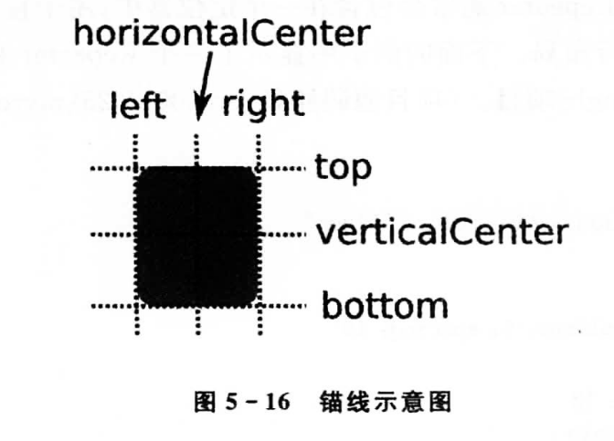
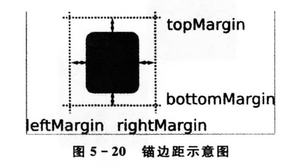

qml

#### item

#### js

#### 

#### 布局

##### 定位器

​	是一个容器，管理其中子项目的布局。Column、Row、Grid、Flow。定位器中的子项目不需要设置x、y坐标，或者锚进行布局。

​	Column将子项目排成一列。使用spacing属性来为子项目添加间距。

​	Row将子项目排成一行。使用spacing属性来为子项目添加间距

​	Grid将子项目排成一个网格，Grid会计算一个足够大的网格容纳子项目，会按照从左向右，从上向下的顺序排列，行数和列数可以通过rows和columns属性指定，使用spacing属性设置子项目的间距，也可以用rowSpacing和columnSpacing属性分别设置水平和垂直方向的间距。还可以使用horizontalItemAlignment和verticalItemAlignment设置水平和垂直方向上的对齐方式。

- 水平：Grid.AlignLeft、Grid.AlignRight和Grid.AlignHCenter;
- 垂直：Grid.AlignTop、Grid.AlignBottom和Grid.AlignVCenter。

​	Flow将子项目从前向后，像流一样布局子项目，通过换行，使子项目排成多行或多列，Flow的子项目会在超出边界后自动换行，每行的子项目数不一定相同。有一个flow属性：Flow.LeftToRight（默认，按照从左向右排序）、Flow.TopToBottom（按照从上到下排序）。

​	过渡（Transition），使用定位器添加删除一个子项目时，可以使用过渡添加动画效果，4个定位器都有add（创建定位器后，添加子项目）、move（删除子项目、通过改变父对象时移除对象）、populate属性（定位器第一次创建时，只会运行一次），分配一个Transition对象。将项目的透明度改为0，会使用move；项目透明度为非0，使用add。

​	Positioner，定位器中会附加一个Positioner类型的对象作为顶层子项目，为定位器中的子项目提供索引信息。

​	Repeater，用来创建大量相似的项目，包含一个模型model属性和一个委托delegate属性。委托用来将模型中的每一个条目进行可视化显示

##### 锚（anchors）布局

**锚边距和偏移**

​	为一个项目的锚指定边距（margin）和偏移（offset）。边距指定了项目锚到外边界的空间量，而偏移则允许使用中心锚线进行定位

**运行时改变锚**

​	可以用AnchorChanges类型，在运行时改变锚，需要在状态State中进行，PropertyChanges类型改变锚的边距。

#### 事件

##### 鼠标事件

**MouseArea**

​	是一个不可见的项目，通常用来和一个可见的项目配合使用，为可视项目提供鼠标处理。鼠标处理的逻辑完全包含在这个MouseArea项目中。

​	enabled属性可以用来设置是否启用鼠标处理，默认为true。false，会不再处理鼠标事件。默认状态下MouseArea只报告鼠标单机，不报告鼠标光标位置改变。可以通过设置hoverEnabled属性为true来进行更改。

​	多个MouseArea重叠，设置propagateComposedEvents属性为true来传播clicked、doubleClicked、pressAndHold等事件，只有在MouseArea没有接受这些事件的时候，才能继续向下传播。需要要在事件处理器中设置accepted为false，这样事件才能继续传播。

**鼠标事件（MouseEvent）和滚轮事件（WheelEvent）**

​	大多数的MouseArea信号都包含了一个mouse参数，是MouseEvent类型的，可以设置accepted属性为true来防止鼠标事件传播到下层；通过x和y属性可以获取鼠标的位置；通过button或buttons属性可获取按下的按键；通过modifiers属性可以获取键盘修饰符。

​	使用WheelEvent获取鼠标滚轮事件，MouseArea的onWheel处理器有一个wheel参数，是WheelEvent类型的。

​	WheelEvent最重要的一个属性是angleDelta，可以获取滚轮滚动的距离，x和y坐标分别保存了水平和垂直方向上的增量。

##### 拖放事件

​	可以使用MouseArea中的drag分组属性，实现简单的拖放。

| 属性                | 作用                                                         | 值                                                           |
| ------------------- | ------------------------------------------------------------ | ------------------------------------------------------------ |
| drag.target         | 指定要拖动的项目id                                           | 对象                                                         |
| drag.active         | 指定目标项目当前是否可以被拖动                               | true或false                                                  |
| drag.axis           | 指定可以拖动的方向                                           | Drag.XAxis：水平方向； Drag.YAxis：垂直方向； Drag.XAndYAxis：水平和垂直方向 |
| drag.minimumX       | 水平方向最小拖动距离                                         | real类型的值                                                 |
| drag.maximumX       | 水平方向最大拖动距离                                         | real类型的值                                                 |
| drag.minimumY       | 垂直方向最小拖动距离                                         | real类型的值                                                 |
| drag.maximumY       | 垂直方向最大拖动距离                                         | real类型的值                                                 |
| drag.filterChildren | 使子MouseArea也启用拖动                                      | true或false                                                  |
| drag.threshold      | 启用拖动的阈值，超过该值才被认为是一次拖动；合理设置阈值可以有效避免用户因抖动等原因造成的拖动误判 | real类型的值（以像素为单位）                                 |

​	复杂的拖放，使用DragEvent，可以通过x和y属性获取拖动的位置；使用keys属性获取可以识别数据类型或源的键列表；通过hasColor、hasHtml、hasText、hasUrls属性确定具体的拖动类型。

​	启动拖动不是直接操作DragEvent，而是使用Drag附加属性和DropArea，DropArea是一个不可见的项目，当其他项目拖动到其上时，可以接收相关的事件。可以通过drag.x和drag.y获取最后一个拖放事件的坐标；使用drag.source获取拖放的源对象；通过keys获取拖放的键列表。当DropArea范围内有拖放进入时，会调用onEntered(DragEvent drag)处理器；当有drop事件发生时，会调用onDropped(DragEvent drop)处理器；当拖放离开时，会调用onExited()处理器；当拖放位置改变时，会调用onPositionChanged(DragEvent drag)处理器。

##### 键盘事件和焦点作用域

##### 定时器（Timer）

​	定时器用来使一个动作在指定的时间间隔触发一次或者多次。interval属性用来设置时间间隔（ms），默认是1000ms；repeat属性用来设置是否重复触发；running属性设置为true时，将开启定时器；定时器触发时会执行onTriggered()。

#### 粒子

#### 动画

#### C++

#### canvas画布

​	本身不提供任何有关绘制的函数，所有的绘制操作都是通过Context2D完成的。getContext()创建Context2D对象，绘制都是在onPaint()事件中进行的。

​	Context2D原点位于左上角，x轴正方向向右，y轴正方向向下。基本的绘制顺序：

1. 设置描边或填充的样式；
2. 创建路径；
3. 描边或填充。

​	Context2D是一个状态机，因此所有设置的属性都会一直起作用，直到下次设置。

##### **绘制参数设置**

1. fillStyle

   ​	fillStyle属性保存填充样式，可以是CSS也可以是CanvasGradient或CanvasPaattern对象。

2. strokeStyle

   ​	strokeStyle属性保存描边样式，可以是CSS也可以是CanvasGradient或CanvasPaattern对象。

3. Pattern

   ​	fillStyle和strokeStyle可以使用纯色，也可以使用纹理。纹理通过pattern定义，使用createPattern(color, patternMode)创建单色模式，

4. lineWidth

   ​	lineWidth属性保存边线宽度。

5. lineJoin

   ​	lineJoin属性保存当前边线的连接样式，连接存在于由两段相连接的线段所共享的子路径。如果子路径是封闭的，连接就是连接这段路径的第一段和最后一段。

6. lineCap

   ​	lineCap属性保存当前边线的端点样式。

7. globalAlpha

   ​	globalAlpha保存全局Alpha值，取值范围是0.0~1.0。

##### **绘制矩形**

- fillRect(x, y, width, height)：填充绘制，x,y是矩形左上角，width,height是矩形宽高。
- strokeRect(x, y, width, height)：描边绘制，x,y是矩形左上角，width,height是矩形宽高。
- clearRect(x, y, width, height)：清空矩形。

