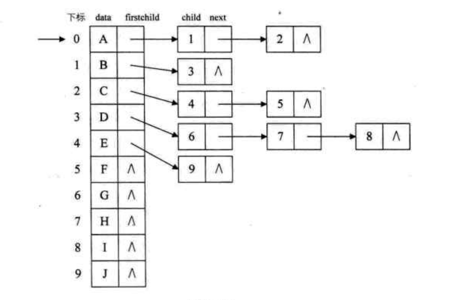
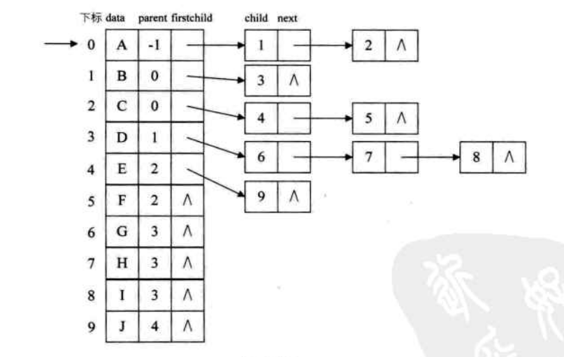
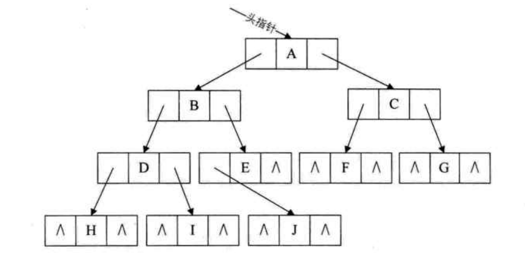

## 数据结构和算法

#### 算法特性

（5个）输入、输出、有穷性、确定性、可行性。

- 输入输出：算法具有零个或多个输入，至少有一个或多个输出

- 有穷性：算法在执行有限的步骤之后，自动结束而不出现无限循环，并且每一个步骤在可接受的时间内完成。

- 确定性：算法的每一个步骤都具有确定的含义，不会出现二义性。

- 可行性：算法的每一步都必须是可行的，也就是说，每一步都能够通过执行有限次数完成。

#### 算法设计规则

**正确性**：

- 算法程序没有语法错误
- 算法程序对于合法的输入数据能够产生满足要求的输出结果
- 算法程序对于非法输入数据能够得出满足规格说明的结果
- 算法程序对于精心选择的，甚至刁难的测试数据都有满足要求的输出结果

**可读性**：

​	算法设计的另一目的为了便于阅读、理解和交流。可读性高有助于人们理解算法，晦涩难懂的算法往往隐含错误，不容易被发现，并且难于调试和修改。

**健壮性**：

​	当输入数据不合法时，算法也能做出相关处理，而不是产生异常或莫名其妙的结果。

**时间效率高和存储量低**：

​	时间效率指的是算法执行时间，对于同一个问题，如果多个算法能够解决，执行时间短的算法效率高。存储量需求指的是算法在执行过程中需要的最大存储空间。

#### 算法效率的度量方法

##### 事前分析估算法

在计算机程序编制前，依据统计方法对算法进行估算。程序在计算机上运行时所消耗的时间取决于：

1. 算法采用的策略和方法（算法好坏的根本）
2. 编译产生的代码质量（编译软件支持）
3. 问题的输入规模
4. 机器执行质量的速度（硬件性能）

#### 算法的渐近增长

​	**函数的渐近增长：给定两个函数f(n)和g(n)，如果存在一个整数N，使得对于所有的n>N，f(n)总是比g(n)大，那么，我们说f(n)的增长渐近快于g(n)。**

​	判断一个算法的效率时，函数中的常数和其他次要项常常可以忽略，而更应该关注主项（最高次项）的阶数。

​	某个算法f(n)，随着n的增大，它会越来越优于另一算法，或者越来越差于另一算法。

#### 算法的时间复杂度

##### 算法时间复杂度的定义

​	**在进行算法分析时，语句总的执行次数T(n)是关于问题规模n的函数，进而分析T(n)随n的变化情况并确定T(n)的数量级。算法的时间复杂度，也就是算法的时间量度，记作T(n) = O(f(n))。它表示随问题规模n的增大，算法执行时间的增长率和f(n)的增长率相同，称作算法的渐近时间复杂度，简称为时间复杂度。其中f(n)是问题规模n的某个函数。**

​	用大写O()来体现算法的时间复杂度的记法，称之为大O记法。

​	一般情况下，随着n的增大，T(n)增长最慢的算法为最优算法。

##### 推导大O阶方法

- 用常数1取代运行时间中的所有的加法常数
- 在修改后的运行次数函数中，只保留最高阶项
- 如果最高阶项存在且不是1，则去除于这个项相乘的常数

##### 常见的时间复杂度

| 阶       | 非正式术语 |
| -------- | ---------- |
| O(1)     | 常数阶     |
| O(n)     | 线性阶     |
| O(n^2)   | 平方阶     |
| O(logn)  | 对数阶     |
| O(nlogn) | nlogn阶    |
| O(n^3)   | 立方阶     |
| O(2^n)   | 指数阶     |


#### 算法空间复杂度

写代码时，可以用空间换取时间。算法的空间复杂度通过计算算法所需的存储空间实现，算法空间复杂度的公式记作：S(n) = O(f(n))，其中，n为问题的规模，f(n)为语句关于n所占存储空间的函数。


#### 线性表

**线性表的抽象数据类型**

前驱，后继，数据

##### 单链表

读取 插入 删除 创建

##### 静态链表

数组表示链表

##### 循环链表

链表首位相连：最后一个节点的指针指向头节点。

##### 双向链表

每个节点都有指向前一个节点和后一个节点的指针。


#### 栈和队列

##### 栈

先进后出LIFO

**抽象数据类型**

同线性表，初始化、销毁、清空、是否为空、返回栈顶元素、压栈、出栈、栈中元素个数

###### 顺序存储结构

数组形式，数组下标（栈顶指针）

###### 链栈（栈的链式存储结构）

栈顶指针->头指针，不需要头节点。

空栈：栈顶指针为空

###### 栈的作用

简化了程序设计问题，划分出了不同关注层次

###### 栈的应用——递归

递归最怕的就是陷入永不结束的递归，所以，**每个递归定义必须有一个条件，满足时递归不再进行**

##### 队列

只允许在一端进行插入操作，而在另一端进行删除操作的线性表。FIFO。

允许插入的一端称为队尾，允许删除的一端称为队头

**抽象数据类型**

同线性表，初始化、销毁、清空、是否为空、插入、删除头元素、队列中元素个数、入队、出队。

###### 循环队列

头尾相接的顺序存储结构称为循环队列 

###### 链式存储（链队列）

线性表的单链表，只能尾进头出。单链表的头结点->队头指针，队尾指针指向终端结点 

#### 串

由0个或多个字符组成的有限序列，又名字符串。

**抽象数据类型**

串中由一个字符组成，相邻元素有前驱和后继关系，复制、清空、长度、拼接、查找、插入、

##### 存储结构

###### 顺序存储

连续的存储单元来存储串中的字符序列，一般是用定长数组，在串的后面加上一个不计入串长度的结束标记字符'\0'，表示串的终结

###### 字符串查找

**普通方式**

O(n^2) 每一个都匹配 比较

**KMP算法**

目的：避免不必要的回溯

next：需要推导数据值

p[0~k-1] == p[j-k~j-1]


```c++
void get_next(int* next,String t)
{
    int j = 0,k = -1;
    next[0] = -1;
    while(j<t.lenth-1)
    {
        if(k == -1 || t[k] == t[j])
        {
            ++j;
            ++k;
            if(t[j] == t[k])
            {
                next[j] = next[k];
            }
            else
            {
                next[j] = k;
            }
        }
        else
        {
            k = next[k];
        }
    }
}
//返回子串T在主串S中第pos个字符之后的位置，若不在在，则返回。
int index_KMP(String S,String T, int pos)
{
    int i = 0;
    int j = 0;
    int next[255];
    get_next(next,T);
    while(i<=S.length&& j <= T.length)
    {
        if(j == -1 || s[i] == t[j])
        {
            ++i;++j;
        }
        else
        {
            j = next[j];//j回退
        }
    }
    if(j >= t.length)
    {
        return (i - t.length);//匹配成功
    }
    else
    {
        return -1;//匹配失败
    }
}
```

**KMP算法改进**

原因：


### 树

树是n个结点的有限集，n=0时称为空树。在任意一棵非空树中：

- 有且只有一个特定的称为根结点
- 当n>1时，其余结点可分为m（m>0）个互不相交的有限集T1、T2，其中每个集合本身又是一棵树，并且称为根的子树。

##### 度

结点拥有的子树数称为结点的度(Degree)。度为0的结点称为叶结点；度不为0的结点称为非终端结点。除根结点外，分支结点也称为内部结点。树的度是树内各结点的度的最大值。

##### 结点间关系

结点的子树的根称为该结点的孩子，该结点称为孩子的双亲。同一个双亲的孩子之间互称兄弟。

##### 高度（深度）

从根开始起，根为第一层，根的孩子为第二层。树中结点的最大层次称为树的深度或高度。

**树的抽象数据类型**

data：树的根结点和子树。树中结点的相同数据类型和层次关系。

operation：构造空树，销毁空树，按照规定构造树，清空树，get深度，get根结点，get结点的值，set结点的值，get结点的双亲，get_left_child，get_right_child

#### 树的存储结构

##### 双亲表示法

​	根结点除外，其他结点 一定有且仅有一个双亲。在每个结点中，设一个指示器指示双亲结点在链表中的位置。

​	

| 数据域，结点数据 | 指针域，双亲指针 |
| ---------------- | ---------------- |
| data             | parent           |

​	很容易找到双亲O(1)。找结点的孩子，遍历O(n)


##### 孩子表示法

​	树中的结点可能有多个子树，每个结点有多个指针域，其中每个指针指向一个子树的根结点，这种方法叫多重链表表示法

1. 指针域的个数就等于树的度。

   ​	data数据域，child(n)是指针域。当树中各结点的度相差很大时，是很浪费空间的，有很多结点的指针域都是空的；度相差很小时，空间被充分利用了。

2. 每个结点指针域个数等于结点的度，取一个位置来存储各结点指针域的个数。

   ​	data数据域，degree度域（存储结点的子结点个数），child(n)指针域。空间利用率高了，各结点的链表结构不同，同时需要维护结点度的数值，需要更多的运算时间

**孩子表示法**

​	把每个结点的孩子结点排列起来，以单链表作存储结构，n个结点有n个孩子链表，如果是叶子结点则此单链表为空。n个头指针又组成一个线性表，采用顺序存储结构，存放进一个一维数组。



​	把孩子表示法和双亲表示法结合一下




##### 孩子兄弟表示法

​	任意一棵树，它的结点的第一个孩子如果在在就是唯一的，它的右兄弟如果在在也是唯一的。可以设置两具指针，分别指向该结点的第一个孩子和此结点的右兄弟。

​	利用孩子兄弟表示法可以把树变成二叉树。


#### 二叉树定义

​	二叉树（binary Tree）是n（n>=0）个结点的有限集合，该集合或者为空集（空二叉树），或者由一个根结点和两棵互不相交的、分别称为根结点的左子树和右子树的二叉树组成。

**二叉树的特点**

- 每个结点最多有两棵子树，所以二叉树中不存在度大于2的结点。注意：不是只有两棵子树，而是最多有。没有子树或者有一棵子树都是可以的。
- 左子树和右子树是有顺序的，次序不能任意颠倒。
- 即使结点只有一棵子树，也要区分是左子树还是右子树

**二叉树具有的五种基本形态：**

1. 空二叉树。
2. 只有一个根结点。
3. 根结点只有左子树。
4. 根结点只有右子树。
5. 根结点既有左子树又有右子树。

##### 特殊二叉树

1. 斜树

   ​	斜树一定是斜的，所有结点都只有左子树的二叉树叫左斜树；所有结点都只有右子树的二叉树叫右斜树。这两者统称为斜树。

2. 满二叉树

   ​	在一棵二叉树中，如果所有分支结点都存在左子树和右子树，并且所有叶子结点都在同一层上，这样的二叉树称为满二叉树。

   ​	**满二叉树的特点**

   - 叶子只能出现在最下一层；
   - 非叶子结点的度一定是2；
   - 在同样深度的二叉树中，满二叉树的结点个数最多，叶子数最多。

3. 完全二叉树

   ​	对一棵具有n个结点的二叉树按层序编号，如果编号为i（1<=i<=n）的结点与同样深度的满二叉树中编号为i的结点在二叉树中的位置完全相同，则这棵二叉树称完全二叉树。

   ​	满二叉树一定是一棵完全二叉树，但完全二叉树不一定是满二叉树。

   ​	**完全二叉树的特点**

   - 叶子结点只能出现在最下两层。
   - 最下层的叶子一定集中在左部连续位置。
   - 倒数二屋，若有叶子结点，一定都在右部连续位置。
   - 如果结点的度为1，则该结点只有左孩子，不存在只有右子树的情况。
   - 同样结点数的二叉树，完全二叉树的深度最小。

#### 二叉树的性质

1. 在二叉树的第i层上至多有$2^{i-1}$个结点（$i\ge1$)。

2. 深度为k的二叉树至多有$2^k-1$个结点（$k\ge1$）。
3. 对任意一棵二叉树T，如果叶子结点数为$n_0$，度为2的结点数为$n_2$，则$n_0=n_2+1$。
4. 具有n个结点的完全二叉树的深度为$\lfloor \log_2n\rfloor+1$

5. 如果对一棵有n个结点的完全二叉树的结点的按层序编号，对任一结点i有：

   1. 如果i=1，则结点i是二叉树的根，无双亲；如果i>1，则其双亲是结点i/2。
   2. 如果2i>n，则结点i无左孩子（结点i为叶子结点）；否则其左孩子是结点2i。
   3. 如果2i+1>n，则结点i无右孩子；否则其右孩子是结点2i+1。


#### 二叉树存储结构

**顺序存储**

用一维数组存储二叉树中的结点，并且结点的存储位置，也和数组下标对应。顺序存储结构一般只用于完全二叉树。

**二叉链表**

二叉树每个结点最多有两个孩子，所以设计一个数据域，两个指针域，这样的链表叫二叉链表。

```c
typedef struct BiTNode{
    TElemType data;//结点数据
    struct BiTNode *lchild, *rchild; //左右孩子指针
}BiTNode, *BiTree;
```




#### 遍历二叉树

二叉树的遍历是指从根结点出发，按照某种**次序**依次**访问**二叉树中所有结点，使得每个结点被访问一次且仅被访问一次。

**二叉树的遍历方法**

- 前序遍历：若二叉树为空，则返回空；先访问根结点，然后前序遍历左子树，再前序遍历右子树。
- 中序遍历：若二叉树为空，则返回空；从根结点开始，中序遍历根结点的左子树，然后访问根结点，最后中序遍历右子树。
- 后序遍历：若二叉树为空，则返回空；从左到右先叶子后结点的方式遍历访问左右子树，最后访问根结点。
- 层序遍历：若二叉树为空，则返回空；从树的第一层，也就是从根结点开始访问，从上而下的逐层遍历，在同一层中，按从左到右的顺序对结点逐个访问。

**线索二叉树**

​	对二叉树以某种次序遍历使其变为线索二叉树的过程称做是线索化。

#### 哈夫曼树

​	从树中的一个结点到另一个结点之间的分支构成两个结点之间的路径，路径上的分支数目称做路径长度。

​	树的路径长度就是从树根到每一结点的路径长度之和。

​	结点带权，带权路径长度为从该结点到根结点之间路径长度与结点上权的乘积。带权路径长度（WPL）最小的二叉树称做哈夫曼树。

​	构造哈夫曼树的哈夫曼算法描述：

1. 根据给定的n个权值{W1,W2,...,Wn}构成n棵二叉树的集合F={T1,T2,...,Tn}，其中每棵二叉树Ti中只有一个带权为Wi根结点，其左右子树均为空。
2. 在F中选取两棵根结点的权值最小的作为左右子树构造一棵新的二叉树，且置新的二叉树的根结点的权值为其左右子树上根结点的权值之和。
3. 在F中删除这两棵树，同时将新得到的二叉树加入F中。
4. 重复2和3步骤，直到F只含一棵树为止。这棵树便是哈夫曼树。

### 图

​	图（Graph）是由顶点的有穷非空集合和顶点之间边的集合组成，通常表示为：G(V,E)，其中，G表示一个图，V是图G中顶点的集合，E是图G中边的集合。

##### 图的各种定义

​	无向边：若顶点Vi到Vj之间的边没有方向，则称这条边为无向边，用无序偶对(Vi,Vj)来表示。如果图中任意两个顶点之间的边都是无向边，则称该图为无向图。

​	有向边：若从顶点Vi到Vj的边有向，则称这条边为有向边，也称为弧。用有序偶<Vi,Vj>表示，Vi称为弧尾，Vj称为弧头。如果图中任意两个顶点之间的边都是有向边，则称该图为有向图。

​	在无向图中，如果任意两个顶点之间都存在边，则称该图为无向完全图。n个顶点的无向完全图有nx(n-1)/2条边。

​	在有向图中，如果任意两个顶点之间都存在方向互为相反的两条弧，则称该图为有向完全图。n个顶点的有向完全图有nx(n-1)条边。

​	有很少条边或弧的图称为稀疏图，反之称为稠密图。稀疏和稠密是相对的、模糊的。

​	与图的边或弧相关的数叫做权，带权的图通常称为网。

​	假设两个图G= (V,{E})和G‘=(V',{E'})，如果$V’\subseteqＶ$且$E'\subseteq E$，则称G'为G的子图。

##### 图的顶点与边间的关系

​	对于无向图G=（V,{E}），如果边$(v,v')\subseteq E$，则称顶点v和v'互为邻接点，即v和v'邻接。边（v,v'）依附于顶点v和v'，或者说（v,v'）与顶点v和v'相关联。顶点v的度是和v相关联的边的数目，记为TD（v）。

​	对于有向图G=（v,{E}），如果弧$<v,v'>\subseteq E$，则称顶点v邻接到顶点v'，顶点v'邻接自顶点v。弧<v,v'>和顶点v，v'相关联。以顶点v为头的弧的数目为v的入度，记为ID(v)；以v为尾的弧的数目为v的出席，记为OD(v)；顶点v的度为TD(v) = ID(v) + OD(v) 。

​	无向图G=（v,{E}）中从顶点v到顶点v'的路径是一个顶点序列。

​	路径的长度是路径上的边或弧的数目。

​	第一个顶点到最后一个顶点相同的路径称为回路或环。序列中顶点不重复出现的路径称为简单路径。除了第一个顶点和最后一个顶点之外，其余顶点不重复出现的回路，称为简单回路或简单环。

##### 连通图相关术语

​	在无向图G中，如果从顶点v到顶点v'有路径，则称v和v'是连通的。如果对于图中任意两个顶点$v_i、v_j\in E$，$v_i和v_j$都是连通的，则称G是连通图。

​	无向图中的极大连通子图称为连通分量。

- 要是子图；
- 子图要是连通的；
- 连通子图含有极大顶点数；
- 具有极大顶点数的连通子图包含依附于这些顶点的所有边。

​	在有向图G中，如果对于每一对$v_i、v_j\in V、v_i \neq v_j$，从vi到vj和从vi到vj都存在路径，则称G是强连通图。有向图中的极大强连通图子图称做有向图的强连通分量。

​	一个连通图的生成树是一个极小的连通子图，它含有图中全部的n个顶点，但只有足以构成一棵树的n-1条边。

​	如果一个有向图恰有一个顶点的入度为0，其余顶点的入度均为1，则是一棵有向树。一个有向图的生成森林由若干棵有向树组成，含有图中全部顶点，但只有足以构成若干棵不相交的有向树的弧。

##### 图术语总结

​	图按照有无方向分为无向图和有向图。无向图由顶点和边构成，有向图由顶点和弧构成。弧有弧尾和弧头之分。

​	图按照边或弧的多少分为稀疏图和稠密图。如果任意两个顶点之间都存在边叫完全图，有向的叫有向完全图。若无重复的边或顶点到自身的边则叫简单图。

​	图中的顶点之间有邻接点、依附的概念。无向图顶点的边数叫度，有向图顶点分为入度和出度。

​	图上的边或弧带权则称为网。

​	图中顶点间存在路径，两顶点存在路径则说明是连通的，如果路径最终回到起始点则称为环，其中不重复叫简单路径。若任意两顶点都是连通的，则图就是连通图，有向则称强连通图，图中有子图，若子图极大连通则就是连通分量，有向的则称强连通分量。

​	无向图中连通且n个顶点n-1条边的叫生成树。有向图中一顶点入度为0其余顶点入度为1的叫有向树。一个有向图由若干棵有向树构成生成森林。

##### 最小生成树

**Prim算法**

**Kruskal算法**

##### 最短路径

**Dijkstra算法**

**Floyd算法**

##### 拓扑排序

无环图的应用，解决一个工程能否顺序进行的问题。

在一个表示工程有有向图中，用顶点表示活动，用弧表示活动之间的优先关系，这样的有向图为顶点表示活动的网，称为AOV网。

拓扑排序是对一个有向图构造拓扑序列的过程。

如果网中的全部顶点都被输出，说明不存在环的AOV网；如果输出顶点少了，存在环，不是AOV网。

**拓扑排序算法** O(n)

​	从AOV网中选择一个入度为0的顶点输出，然后删去此顶点，并删除以此顶点为尾的弧，直到输出全部顶点或者AOV网中不存在入度为0的顶点为止。

##### 关键路径

​	在一个表示工程的带权有向图中，用顶点表示事件，用有向边表示活动，用边上的权值表示活动的持续时间，这种有向图的边表示活动的网，叫AOE网。

​	AOE网中。没有入边的顶点称为始点或源点，没有出边的顶点称为终点或汇点。

​	路径上各个活动所持续的时间之和称为路径长度，从源点到汇点具有最大长度的路径叫关键路径，在关键路径上的活动叫关键活动。

**关键路径算法**


**关键路径算法**


# 算法

### 线段树

	线段树是一种二叉搜索树，是利用小区间来更新大区间的，一般在使用过程中，开辟4N的数组，防止溢出。
	
	线段树利用区间加法，把[L,R]的区间，转换为[L,M]+[M+1,R]的2块小区间，再进行计算。线段树一般用于计算区间和，最大区间，最小区间。
	
	一般的流程是：建立4N的数组（建树），区间修改，查询。

**单点修改：**
从根节点开始，[L,R]包含i，访问左子树，否则访问右子树。
L=R，搜索到了，可以修改，更新区间，


**查询区间**
a.查询是否完全覆盖
b.与左子树是否有交际，
 a).搜索左子树
c.与右子树是否有交际，
 a).搜索右子树
左右子树归并


